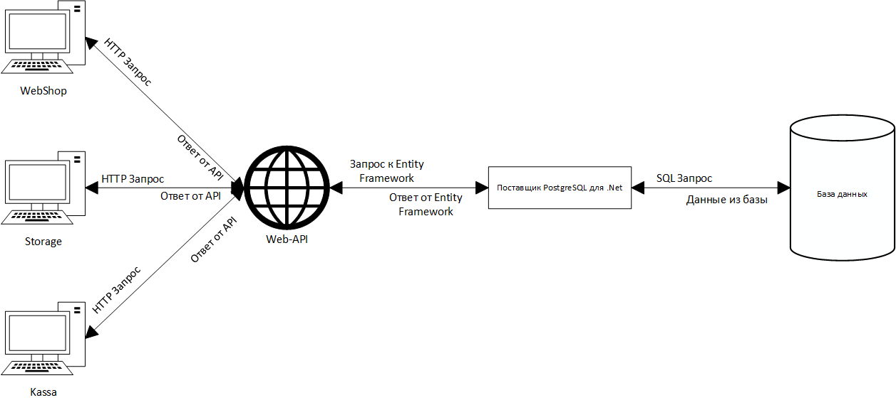

# Курсовой проект "qwerty-shop"

## Содержание

## Введение

### Структура программы

Схема взаимодействия приложений с Web-API и базой данных

api - сервер для связи базы и приложений

webshop - веб-приложение магазина

kassa - дестктоп-приложение кассы для сотрудников отдела зала магазина

storage - дестктоп-приложения склада для сотрудников отдела складирования на складе
